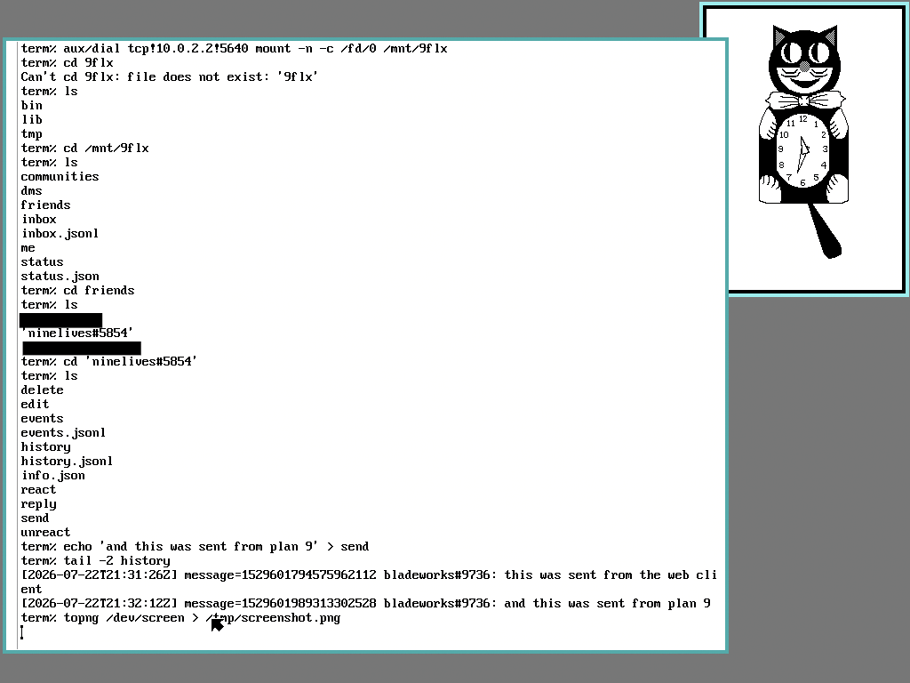

# 9flx

9flx turns your Fluxer account into a 9P filesystem. Everything becomes a file: read a conversation with `cat history`, or send a message with `echo 'hello' > send`.

## Why?

A counter-question: Why not?

## Run

Go 1.24 or newer is required.

```sh
go build -o 9flx ./cmd/9flx
install -m 600 /dev/null "$HOME/.config/fluxer-token"
printf '%s' "$YOUR_FLUXER_SESSION_TOKEN" > "$HOME/.config/fluxer-token"
./9flx serve --token-file "$HOME/.config/fluxer-token"
```

The 9P server has no authentication as of now, so do not expose it to an untrusted network.

## Mount

Linux:

```sh
sudo mkdir -p /mnt/9flx
sudo mount -t 9p -o trans=tcp,port=5640,version=9p2000,uname=9flx 127.0.0.1 /mnt/9flx
```

## Use

Each directory under `friends`, `dms`, and `communities/*/channels` contains `history`, `events`, `send`, `edit`, `reply`, `delete`, `react`, and `unreact`.

```sh
cat history
echo 'hello' > send
echo '123456789 corrected text' > edit
echo '123456789 a reply' > reply
echo '123456789 👍' > react
echo '123456789' > delete
cat "$HOME/Downloads/cat.png" > send
```

To send an attachment with a filename and caption:

```sh
{
    echo '!attach cat.png'
    echo 'look at this creature'
    echo
    cat "$HOME/Downloads/cat.png"
} > send
```

`me`, friend directories, and one-to-one DMs also expose the user's profile picture as `avatar` and its CDN address as `avatar.url`.

```sh
cp avatar /tmp/avatar
cat avatar.url
```

## Does it work on Plan 9?

Sure does.



Start 9flx with a listener reachable from the Plan 9 machine:

```sh
./9flx serve --listen 0.0.0.0:5640 --token-file "$HOME/.config/fluxer-token"
```

Mount it from Plan 9:

```rc
mkdir -p /mnt/9flx
aux/dial tcp!server.example!5640 mount -n -c /fd/0 /mnt/9flx
```

## License

MIT
